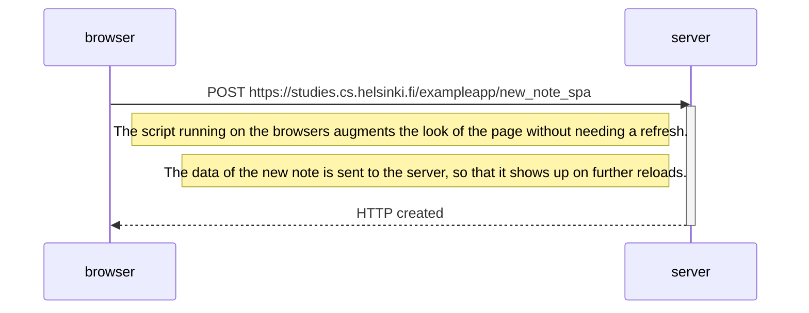

# New note diagram for [spa](https://studies.cs.helsinki.fi/exampleapp/spa)

```mermaid
sequenceDiagram
    participant browser
    participant server

    browser->>server: POST https://studies.cs.helsinki.fi/exampleapp/new_note_spa
    activate server
    Note right of browser: The script running on the browsers augments the look of the page without needing a refresh.
    Note left of server: The data of the new note is sent to the server, so that it shows up on further reloads. 
    server-->>browser: HTTP created
    deactivate server
```
